# Telco Project — i2i Systems Developer Task

**Developer:** Zeynep Sıla Durak 
**Date:** 2026-05-06  
**Database:** Oracle XE 21c (Docker)  
**Tools:** DBeaver, Docker Desktop

---

## Repository Structure

```
telco-project/
├── docker-compose.yml            # Oracle XE environment definition
├── init-scripts/
│   └── 01_create_tables.sql     # Auto-runs on first container start
├── TABLE_CREATION_SCRIPTS.sql   # Full table DDL with constraints & indexes
├── SOLUTIONS.sql                # All query solutions with 3-sentence comments
└── README.md                    # This file
```

---

## Step-by-Step Setup Guide

### Prerequisites

| Tool | Download Link | Notes |
|------|---------------|-------|
| Docker Desktop | https://www.docker.com/products/docker-desktop/ | Enable WSL2 on Windows |
| DBeaver Community | https://dbeaver.io/ | Free, cross-platform |
| Git | https://git-scm.com/ | To clone/push the repo |

---

### STEP 1 — Clone Your Repository

```bash
git clone https://github.com/zeynepsldrk/telco-project.git
cd telco-project
```

> The project repository was successfully cloned from GitHub to the local machine.

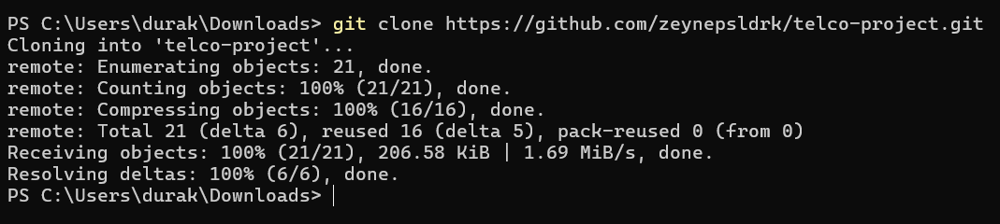

---

### STEP 2 — Install & Start Docker Desktop

1. Download and install **Docker Desktop** from the link above.  
2. Open Docker Desktop and wait until the bottom-left status says **"Engine running"**.

> The Oracle XE container is shown as running on Docker Desktop.

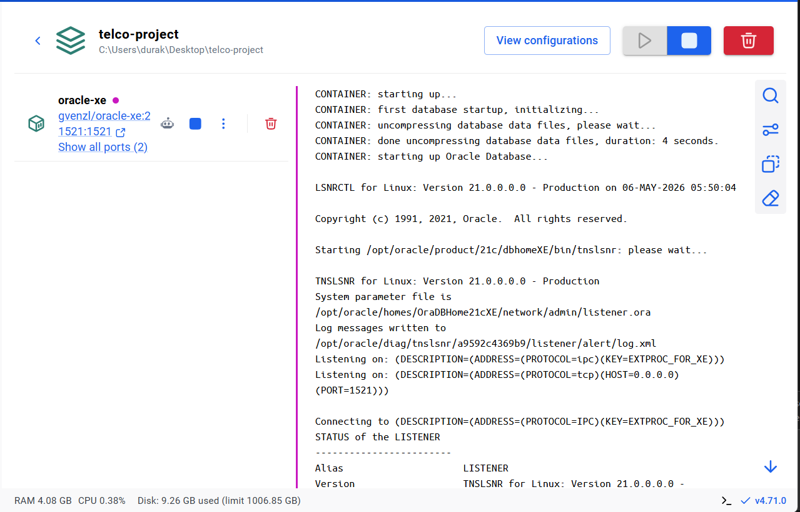

---

### STEP 3 — Start Oracle XE via Docker Compose

Open a terminal in the project root folder (where `docker-compose.yml` lives) and run:

```bash
docker compose up -d
```

This will:
- Pull the `gvenzl/oracle-xe:21-slim` image (~800 MB, first run only)
- Create a container named `telco_oracle_xe`
- Expose port **1521** on your local machine
- Automatically run `init-scripts/01_create_tables.sql` on first boot

Wait ~2–3 minutes for Oracle to fully initialise. Check logs:

```bash
docker compose logs -f oracle-xe
```

Wait until you see:
```
DATABASE IS READY TO USE!
```

> The Oracle XE container logs display the DATABASE IS READY TO USE message.

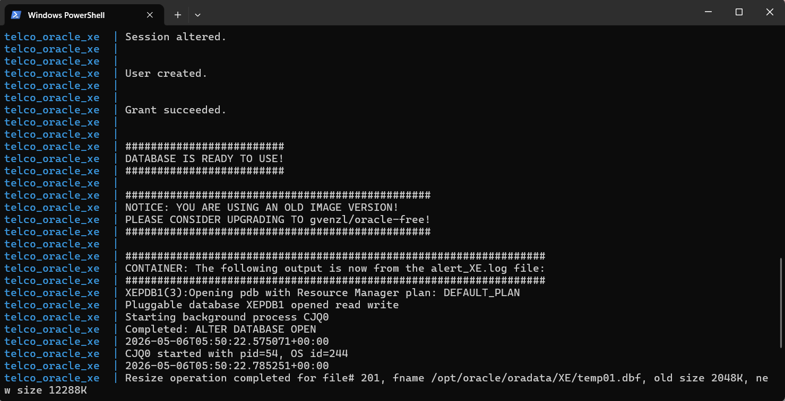

Then verify the container is healthy:

```bash
docker ps
```

> The docker ps command confirms the container is in a healthy state.

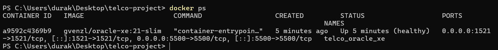

---

### STEP 4 — Connect DBeaver to Oracle XE

1. Open **DBeaver**.
2. Click **New Database Connection** (plug icon in top-left toolbar).
3. Select **Oracle** and click **Next**.
4. Fill in the connection details:

| Field | Value |
|-------|-------|
| Host | `localhost` |
| Port | `1521` |
| Database / SID | `xepdb1` |
| Authentication | Database Native |
| Username | `telco_user` |
| Password | `TelcoUser123` |

5. Click **Test Connection** — you should see **"Connected"**.
6. Click **Finish**.

> The Oracle connection in DBeaver was configured with localhost:1521/xepdb1 and telco_user credentials.

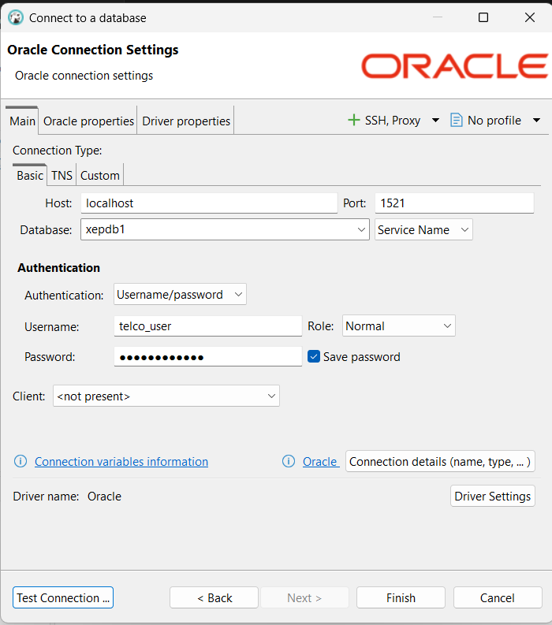

> The DBeaver connection test completed successfully, connecting to Oracle Database 21c Express Edition in 344ms.

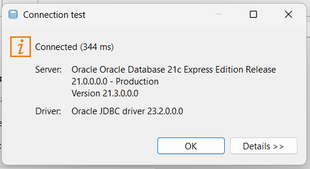

---

### STEP 5 — Verify Tables Were Auto-Created

In DBeaver's left panel:

```
Connections → Oracle (localhost) → Schemas → TELCO_USER → Tables
```

You should see all 5 tables:
- `CITIES`
- `CUSTOMERS`
- `MONTHLY_USAGE`
- `PAYMENTS`
- `TARIFFS`

> 5 tables were successfully created under the TELCO_USER schema: CITIES, CUSTOMERS, MONTHLY_USAGE, PAYMENTS, TARIFFS.

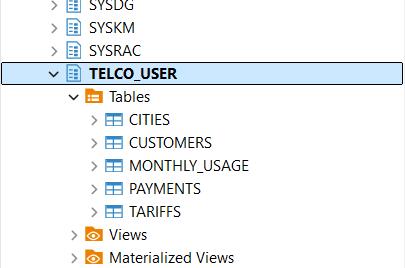

If the tables are not there (e.g., init script didn't run), run `TABLE_CREATION_SCRIPTS.sql` manually:

1. Right-click the `TELCO_USER` schema → **SQL Editor → Open SQL Script**
2. Open `TABLE_CREATION_SCRIPTS.sql`
3. Press **Ctrl+Alt+X** (Execute All) or click the Run button
4. Refresh the Tables node

---

### STEP 6 — Import CSV Data

For each CSV file provided with the project:

1. Right-click the target table in DBeaver → **Import Data**
2. Select **CSV** as the source format
3. Browse to the CSV file
4. On the **Column Mapping** screen, match CSV columns to table columns
5. Click **Proceed** → **Start**

>The validation query confirms all tables are populated with the correct number of records. 

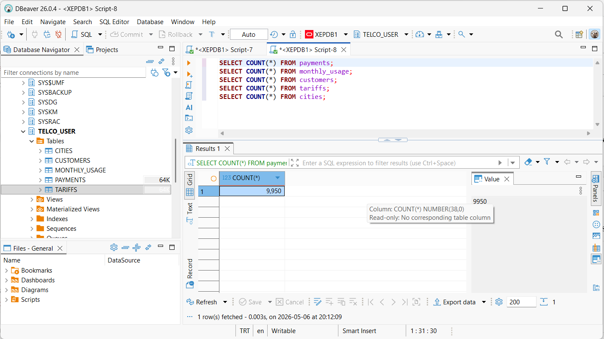

| TABLO | ADET |
|---|---|
| CITIES | 81 |
| TARIFFS | 4 |
| CUSTOMERS | 10000 |
| MONTHLY_USAGE | 9950 |
| PAYMENTS | 9950 |

---

### STEP 7 — Run the SQL Solutions

1. In DBeaver, open **SQL Editor → Open SQL Script**
2. Select `SOLUTIONS.sql`
3. Run each query block individually by selecting it and pressing **Ctrl+Enter**
4. Check the Results panel at the bottom for output

> Question 1.1 — The list of customers subscribed to the 'Kobiye Destek' tariff is displayed.

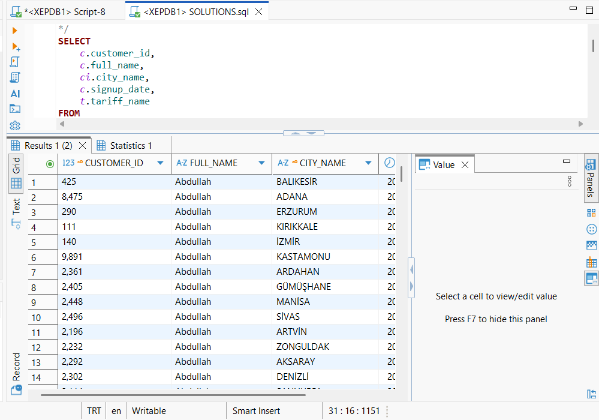

> Question 1.2 — The 7 most recently subscribed customers on the 'Kobiye Destek' tariff are listed; all sharing the same signup date of 2026-04-05.

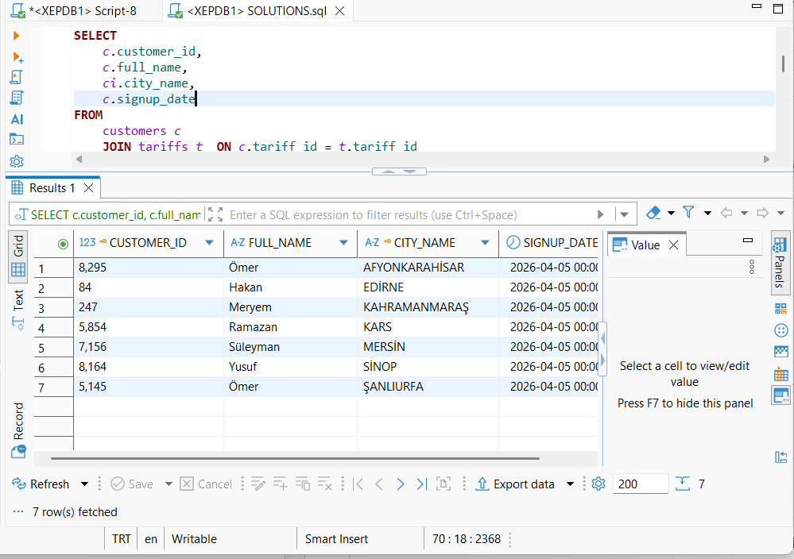

> Question 2.1 — Tariff distribution was queried; Kurumsal SMS has the most subscribers (25.77%) and Çalışan GB the fewest (24.13%).

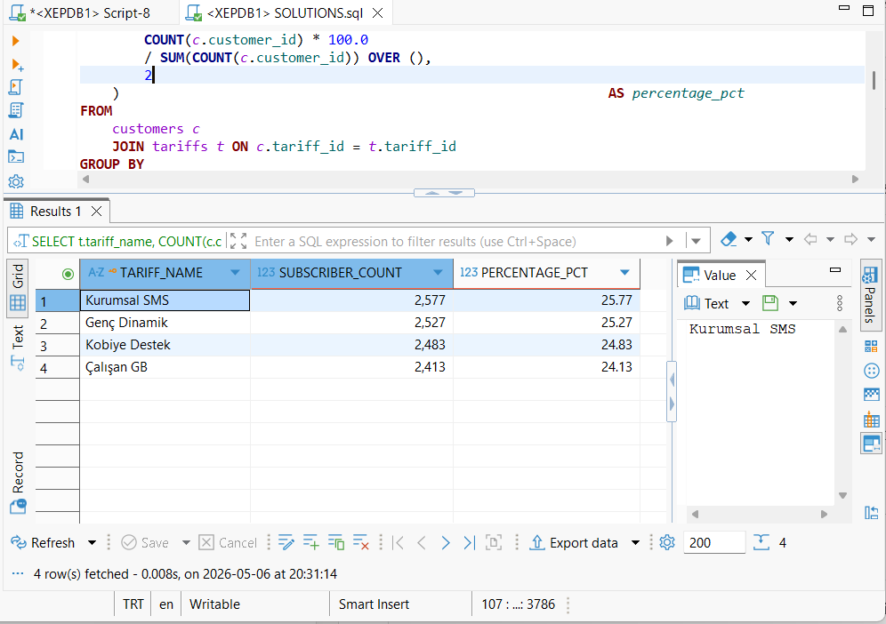

> Question 3.1 — The 35 earliest signed-up customers were identified using the DENSE_RANK() function.

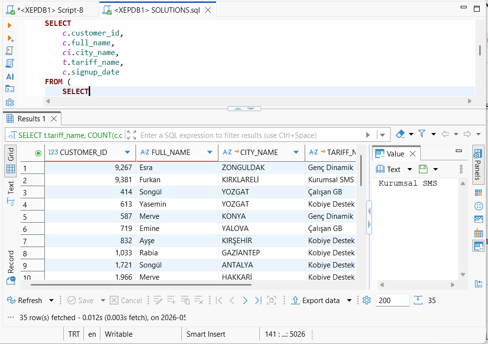

> Question 3.2 — The distribution of earliest customers across cities was listed; Gaziantep, Şırnak, Sakarya, Yozgat, and Antalya have the most.

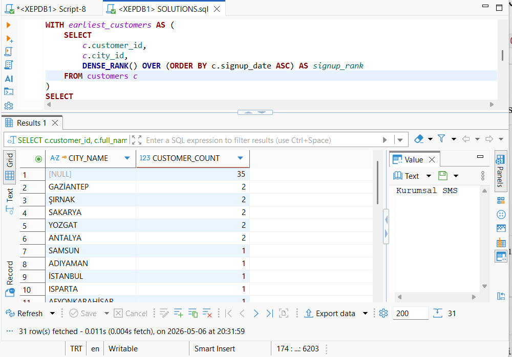

> Question 4.1 — 50 customers with missing monthly usage records were identified using a LEFT JOIN anti-join pattern.

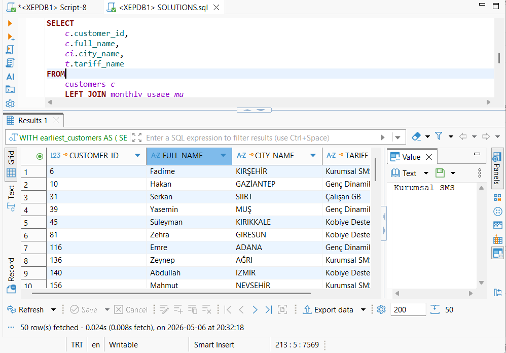

> Question 4.2 — The city distribution of customers with missing records was queried; Osmaniye is the most affected city (3 missing, 6%).

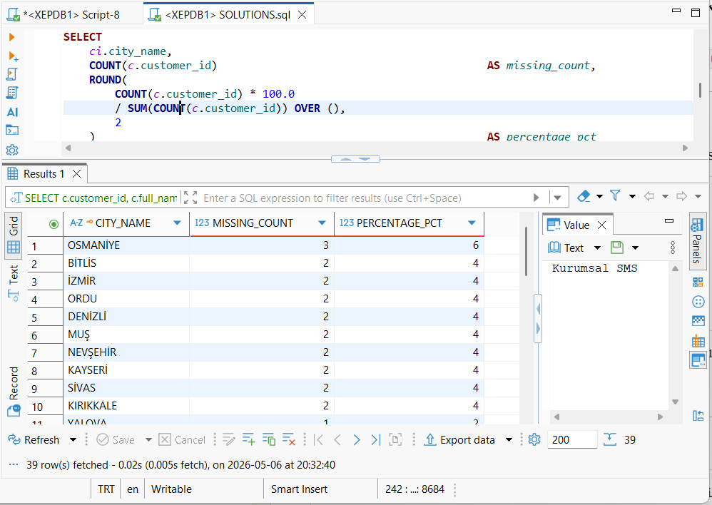

> Question 5.1 — Customers who have used 75% or more of their data limit were listed.

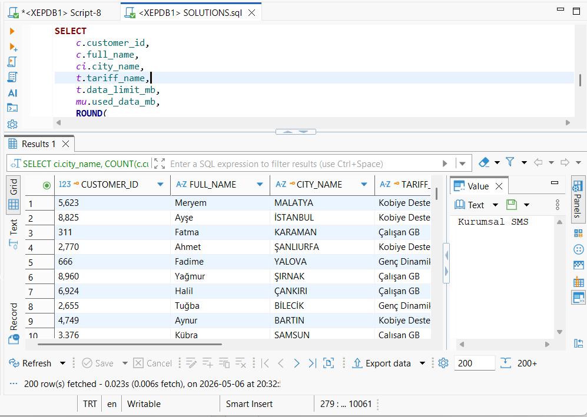

> Question 5.2 — No customers were found who exhausted all three limits simultaneously (0 results).

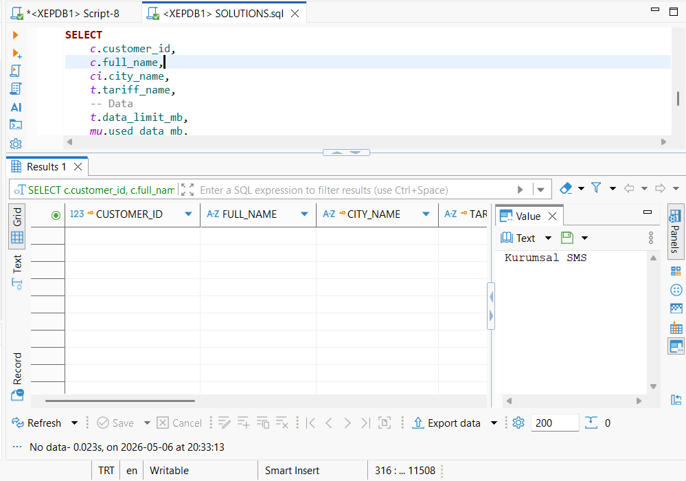

> Question 6.1 — Customers with unpaid fees were listed, showing records with UNPAID and OVERDUE status.

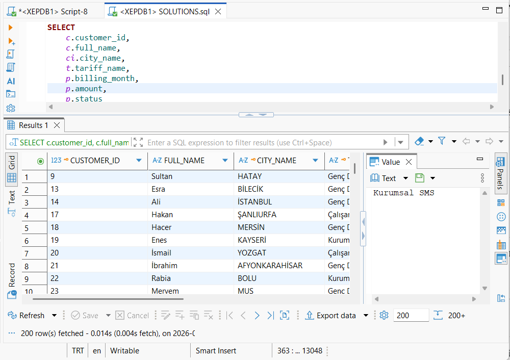

> Question 6.2 — Payment status distribution across all tariffs was displayed in pivot format; the PENDING column is 0 for all tariffs as this value does not exist in the source data.

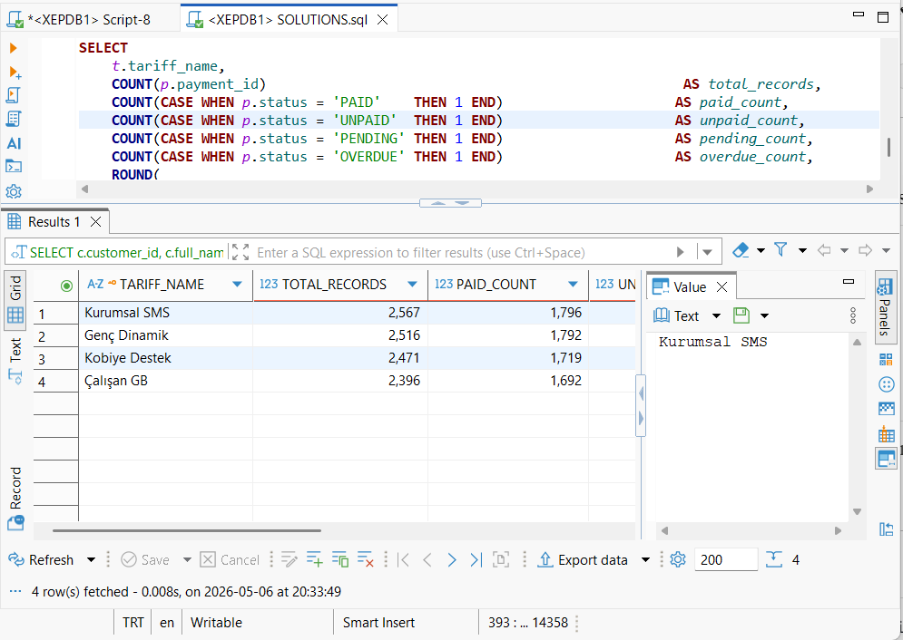

---

### STEP 8 — Commit & Push to GitHub

```bash
git add .
git commit -m "Add TABLE_CREATION_SCRIPTS, SOLUTIONS, docker-compose, and README"
git push
```

## Database Schema

```
cities (city_id PK, city_name)
    ↑
customers (customer_id PK, first_name, last_name, phone_number, email,
           city_id FK→cities, tariff_id FK→tariffs, signup_date)
    ↑                                               ↑
monthly_usage (usage_id PK, customer_id FK,    tariffs (tariff_id PK, tariff_name,
               record_month, used_data_mb,              data_limit_mb, minutes_limit,
               used_minutes, used_sms)                  sms_limit, monthly_fee)
                                                         ↑
payments (payment_id PK, customer_id FK, tariff_id FK, billing_month,
          amount, status, payment_date)
```

### Table Descriptions

| Table | Purpose |
|-------|---------|
| `cities` | Lookup table for city names |
| `tariffs` | Tariff/plan definitions with limits and monthly fee |
| `customers` | Customer master records with city and tariff references |
| `monthly_usage` | Current-month usage metrics per customer |
| `payments` | Monthly payment records with status tracking |

---

## Connection Credentials Reference

| Parameter | Value |
|-----------|-------|
| Host | `localhost` |
| Port | `1521` |
| SID | `xe` |
| App Username | `telco_user` |
| App Password | `TelcoUser123` |
| SYS/SYSTEM Password | `TelcoPass123` |

---

## Stopping & Restarting the Database

```bash
# Stop (data is preserved in volume)
docker compose down

# Start again
docker compose up -d

# Full reset (DELETES ALL DATA)
docker compose down -v
docker compose up -d
```

---

## Troubleshooting

| Problem | Solution |
|---------|----------|
| Port 1521 already in use | Change `"1521:1521"` to `"1522:1521"` in docker-compose.yml and use port 1522 in DBeaver |
| Container stays unhealthy | Wait longer (up to 5 min on first boot), check logs with `docker compose logs oracle-xe` |
| ORA-12505 (SID not found) | Change connection type from SID to **Service Name** and use `xe` |
| Tables not created on boot | Run `TABLE_CREATION_SCRIPTS.sql` manually in DBeaver |
| Import CSV fails | Make sure date columns match format `YYYY-MM-DD` or adjust DBeaver date format in preferences |